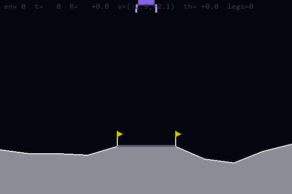
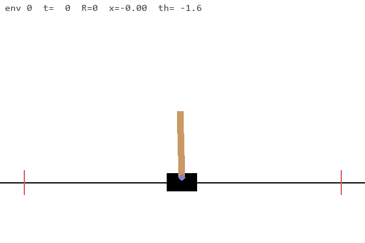
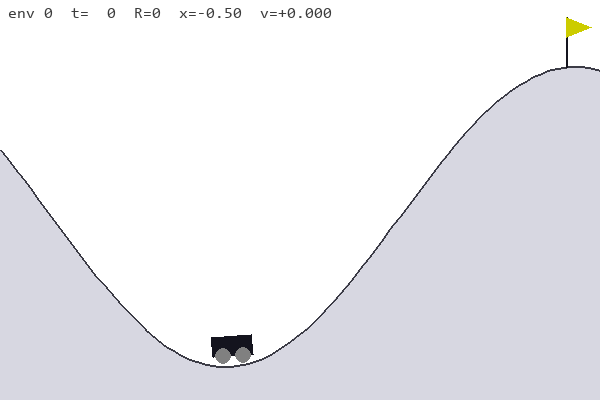
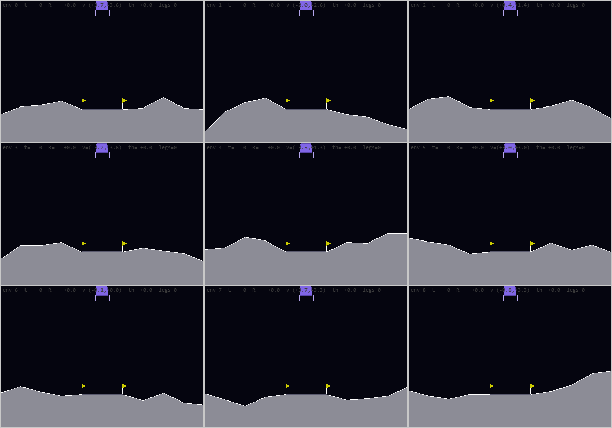

# Reinforcement learning in NVIDIA Warp, JAX and Stable-Baselines3

Three classic-control environments and a PPO trainer, implemented three times:
in [NVIDIA Warp](https://github.com/NVIDIA/warp) kernels with
[warp-nn](https://pypi.org/project/warp-nn/), in JAX + Flax + optax, and -- via a
Gymnasium adapter -- with [Stable-Baselines3](https://github.com/DLR-RM/stable-baselines3)'s
reference PPO. Everything that does not depend on *how* the maths is computed --
the environment specifications, the hyperparameters, the registry, the renderers,
the training-loop and evaluation scaffolding -- lives once, in `rl_common`.

```
python scripts/train.py --env cartpole                    # warp (default backend)
python scripts/train.py --env cartpole --backend jax      # the same run in JAX + Flax
python scripts/train.py --env cartpole --backend sb3      # ... or SB3's reference PPO
python scripts/train.py --env cartpole --backend sb3 --env-backend gym   # SB3 on stock Gymnasium
python scripts/play.py  --env lunarlander --weights weights/lunarlander.npz   # watch it fly
python -m pytest tests -q                                 # 99 checks, all backends
```





## Results

Greedy evaluation over 128 episodes, with each environment's recommended
settings -- the same hyperparameters for all three backends.

| environment | warp | jax | sb3 | budget | solved |
| --- | --- | --- | --- | --- | --- |
| cartpole | **500.0 +/- 0.0** | **500.0 +/- 0.0** | **500.0 +/- 0.0** | 500k steps | 475 |
| mountaincar | **-102.0 +/- 8.8** | **-98.4 +/- 9.0** | **-101.8 +/- 8.7** | 4M decisions | -110 |
| lunarlander | **274.5 +/- 18.6** | **286.2 +/- 29.1** | **282.5 +/- 19.6** | 16M steps | 200 |

Wall clock for those runs: cartpole ~5 s (warp) / 24 s (jax) / 17 s (sb3);
mountain car ~8 s / 63 s / 45 s; the lander ~60 s / 12 min / 3.5 min.

The JAX and SB3 backends are reproducible run to run; the Warp one is not --
its PPO loss is accumulated with `wp.atomic_add`, and float addition on the GPU
is order-dependent, so the same seed lands within a band (a 65k-step cartpole
run scored 251, 314, 327 and 337 across four repeats) rather than on a number.

Throughput on this machine: Warp reaches 85k-170k env steps/s on cartpole,
~290k on the lander and ~520k on mountain car, *including* the PPO update. SB3
(torch on the CPU, driving our Warp environments) gets 29k / 75k / 89k, and its
cost is the per-step host round-trip its `VecEnv` API requires. The JAX numbers
were measured against a **CPU-only** jaxlib, before the `jax` extra asked for a
CUDA build, so they describe a different machine class rather than a different
algorithm: ~21k steps/s on cartpole, ~63k on mountain car and ~23k on the
lander. The extra now installs `jax[cuda13]` on Linux, so the same code runs on
the GPU and those three numbers are due a re-measurement.

## Layout

```
rl_common/     shared: specs, config, registry, renderers, Gymnasium adapter,
               training loop
warp_rl/       backend: Warp kernels + warp-nn networks + tape-based PPO
jax_rl/        backend: pure-function envs + Flax networks + jitted PPO
sb3_rl/        backend: SB3's PPO on our envs through a VecEnv adapter
scripts/       train.py  --env {cartpole,lunarlander,mountaincar} --backend {warp,jax,sb3}
               play.py   same flags, plus recording and N-environment grids
tests/         per-environment checks (all backends), the 3x3 problem x
               trainer matrix, cross-backend parity, the shared core
               (CLI/registry/checkpoint portability)
tools/         Box2D cross-check for the lander, warp <-> jax weight conversion
```

| shared (`rl_common/`) | |
| --- | --- |
| `specs/{cartpole,lunar_lander,mountain_car}.py` | every physical constant, the lander's rigid-body properties, the observation/shaping formulas |
| `config.py` | `PPOConfig`, including learning-rate annealing |
| `agent.py` / `trainer.py` | the two interfaces a backend implements: `Agent` (act / save / load) and `Trainer` (which supplies `train`, `evaluate` and environment construction, leaving only `iterate` to the backend) |
| `registry.py` | env id -> shape, recommended PPO settings, renderer, and the class each backend implements it with (imported lazily, so using JAX never imports Warp) |
| `cli.py` | the flags `train.py` and `play.py` share, and `PPOConfig` from them |
| `render/` | `TiledRenderer` plus one renderer per environment -- they only ever see numpy, via each env's `render_state()` |
| `gym_api.py` | `GymEnv`: any of our environments as a standard `gymnasium.Env`, and `register()` to publish them as `WarpCartPole-v0`, `JaxLunarLander-v0`, ... |
| `training.py` | the iteration loop (annealing, timing, logging), greedy evaluation |
| `arrays.py` | `to_numpy` for Warp or JAX arrays |

| warp backend (`warp_rl/`) | | jax backend (`jax_rl/`) | |
| --- | --- | --- | --- |
| `vec_env.py` | `WarpVecEnv`: device buffers, RNG, bookkeeping kernels | `vec_env.py` | `vec_reset`/`vec_step` (pure, vmapped, jittable) + `JaxVecEnv` shell |
| `envs/*.py` | physics as `@wp.kernel` | `envs/*.py` | physics as pure single-env functions |
| `agent.py` | warp-nn MLPs, orthogonal init | `agent.py` | Flax MLPs, same architecture and init |
| `kernels.py` | sampling, GAE, gathers, PPO loss | `ppo.py` | the same maths in jitted `lax.scan`s |
| `ppo.py` | `wp.Tape` gradients, CUDA-graph capture | `ppo.py` | one jitted iteration, optax Adam |

Each backend's `ppo.py` implements exactly one method -- `iterate(lr)`, one
rollout plus one update -- and inherits the loop, the annealing, the logging
and the evaluation from `rl_common.Trainer`; each `agent.py` implements `act`,
`save` and `load` and inherits `act_numpy` from `rl_common.Agent`.

The third backend is deliberately thin -- it contributes no environments and no
learner, only adapters: `sb3_rl/vec_env.py` presents our vectorized environments
as an SB3 `VecEnv` (one batched step, one host copy, no per-environment Python
loop), `sb3_rl/agent.py` puts an SB3 policy behind the same `act`/`save`/`load`
interface as the others, and `sb3_rl/ppo.py` drives `stable_baselines3.PPO` one
iteration at a time from the *shared* training loop.

Roughly 1400 lines of shared code, 1850 of Warp, 1100 of JAX, 430 of SB3 glue,
and 1800 of tests.

## What is shared, and what is not

The two backends are the same *specification* computed two different ways, so
the split follows that line:

* **Shared, because it is the definition of the problem**: constants, the
  observation and reward formulas, the terrain layout, the recommended
  hyperparameters, the solved thresholds, the time limits.
* **Shared, because it is host-side plumbing**: the registry, the renderers
  (they take numpy from `render_state()`), the training loop with its
  annealing/logging, greedy evaluation, and the CLIs.
* **Written twice, because the compute model differs**: the physics (Warp
  kernels mutating device arrays vs. pure functions that JAX vmaps), the
  networks, and PPO itself (a `wp.Tape` with CUDA-graph capture vs. a jitted
  `lax.scan` with optax).
* **Adapted, not rewritten**: SB3 brings its own PPO, so that backend only
  translates -- our environments into a `VecEnv`, its policy into our agent
  interface -- and reuses the shared loop for annealing, logging and evaluation.

Both backends expose the same Python API -- `reset` / `step` /
`pop_episode_stats` / `render_state`, and an agent with `act` / `save` / `load`
-- which is what lets `play.py`, the renderers and the evaluation helper be
written once.

### Adding an environment

Add its constants to `rl_common/specs/`, write a `WarpVecEnv` subclass (two
hooks: `_reset`, `_step`) and/or a functional JAX env (`reset(key)`,
`step(key, state, action)`), add a `TiledRenderer` subclass, then one `EnvSpec`
entry in `rl_common/registry.py`. `--env myenv --backend either` then works
everywhere.

## Keeping the two implementations honest

`tests/test_backend_parity.py` pins the backends to each other rather than
trusting that they agree:

```
cartpole: one-step dynamics identical across backends (max |diff| = 9.54e-07)
mountaincar: one-step dynamics identical across backends (max |diff| = 5.96e-08)
lunarlander one-step dynamics: max |warp - jax| = 1.02e-06 over 50 random states
lunarlander unpowered descent: max |obs diff| = 2.23e-04 over 200 steps
mountaincar with action_repeat=8: warp and jax agree over 25 decisions
networks agree given identical weights (logits 3.03e-09, values 3.58e-07)
GAE agrees across backends (advantages 1.91e-06, returns 1.91e-06)
both backends learn cartpole: warp 21 -> 126, jax 21 -> 122
```

The network test copies the Warp weights into the Flax parameter tree and
checks both produce the same logits and values; the GAE test runs the Warp
kernel and the JAX scan on the same synthetic rollout. On top of that, every
environment's own test file runs against **both** backends: CartPole and
Mountain Car are compared step-for-step against Gymnasium (exact to float32),
and the lander's spec tests plus Gymnasium's heuristic controller run on each.

Checkpoints are portable in the same spirit -- the two backends only differ by a
name and a transpose:

```
python tools/convert_weights.py --env lunarlander --from warp --to jax \
    weights/lunarlander.npz weights/jax/lunarlander.npz
```

The Warp-trained lander, converted to Flax and evaluated in the *JAX*
environment, scores 281.9 +/- 17.6 -- the same policy in the same task, with
every line of physics and inference underneath it replaced.

## The environments

**CartPole** -- a line-by-line port of `CartPole-v1` (`euler` integrator).
Both backends agree with Gymnasium to `2.4e-07` over 200 steps and terminate on
exactly the same step.

**Mountain Car** -- a line-by-line port of `MountainCar-v0` (exact to `6e-08`),
plus one addition: `action_repeat`. The reward is `-1` per step and nothing
else, so with uniformly random actions the flag is unreachable -- **0 of 4096
episodes** -- and PPO has no signal at all. Holding each action for 8 physics
steps makes random exploration resonate up the hill (55 of 4096), which is the
difference between unlearnable and solved in 8 seconds. Rewards still count
physics steps, so returns stay comparable to `MountainCar-v0`, and
`action_repeat=1` is the untouched environment.

**Lunar Lander** -- Gymnasium's task definition (terrain with its `0.33`
smoothing quirk, the 8-dim observation, the shaping reward and fuel costs, the
engine impulses with their dispersion, `+/-100` terminals) on a rigid-body
solver of our own instead of Box2D: hull plus welded legs with the mass, centre
of mass and inertia computed from Box2D's own polygons and densities (4.96 kg,
0.92 kg m^2), 8 substeps, penalty leg contacts with friction, and a 4 m/s
impact-crash rule standing in for legs that would snap. All deviations are
listed at the top of `rl_common/specs/lunar_lander.py`.

Validation: Gymnasium's own `demo_heuristic_lander`, unmodified, scores **249.8
(warp) / 253.2 (jax)** here and lands ~119 of 128 times;
`tools/crosscheck_box2d.py` runs it in both worlds and gets 242.3 here vs 243.8
in real Box2D. A *learned* policy transfers poorly back to Box2D -- 44.5 for the Warp-trained
one, 51.1 for the JAX-trained one, neither landing cleanly. Both learn to land
the way our compliant legs reward, and they fail the same way, which is itself
evidence the two backends model the same world. Train against the physics you
intend to fly.

## Gymnasium and Stable-Baselines3

The third backend exists to answer a different question from the first two: not
"how fast can this be" but "does the rest of the ecosystem accept it".

`rl_common.gym_api.GymEnv` presents any of our environments -- on either
compute backend -- as an ordinary `gymnasium.Env`, and `register()` publishes
them under `WarpCartPole-v0`, `JaxLunarLander-v0` and so on:

```python
import gymnasium as gym
from rl_common.gym_api import register

register()
env = gym.make("WarpLunarLander-v0")     # our Warp physics, standard API
```

All six pass `stable_baselines3.common.env_checker.check_env`, and a test steps
the adapter and the vectorized environment side by side to confirm the single-env
view is the same environment.

For training, `sb3_rl.vec_env.VecEnvAdapter` skips the single-env detour and
hands SB3 the whole batch at once, translating our same-step auto-reset into
SB3's `terminal_observation` / `TimeLimit.truncated` convention. `--backend sb3`
then trains with SB3's PPO on our environments, and `--env-backend gym` swaps in
stock Gymnasium environments for a same-learner reference run.

**One finding worth recording.** With identical hyperparameters, SB3 initially
failed on mountain car -- `-200.0`, never reaching the flag, while our two
backends solved it. It was not the adapter: SB3 driving its own `learn()` loop
failed the same way, and so did SB3 on *stock* `MountainCar-v0`, so the failure
followed the learner rather than the environment. The cause turned out to be
Adam's epsilon: SB3 defaults to `1e-5` (inherited from OpenAI baselines) where
warp-nn and optax use `1e-8`. On a task whose gradients are rare and tiny, that
epsilon swamps the update -- with `eps=1e-8` SB3 solves mountain car at
`-101.8`, matching the others. The backend now sets it explicitly, and the
episode is a decent argument for keeping three implementations around.

## Watching it play

```
python scripts/play.py --env lunarlander --weights weights/lunarlander.npz
python scripts/play.py --env lunarlander --num-render 9 --tile 400 280    # nine landers at once
python scripts/play.py --env mountaincar --backend jax --weights weights/jax/mountaincar.npz
python scripts/play.py --env cartpole --gif media/cartpole.gif            # record instead of display
python scripts/play.py --env lunarlander --random --stochastic            # an untrained policy
```

The renderer is shared, so the same pictures come out of either backend. With
no `--weights` it trains first and then plays. Recording works headless
(`SDL_VIDEODRIVER=dummy`), and `--gif out.mp4` writes video instead of a GIF.



## The algorithm

Standard PPO, identical on both sides: rollout with a categorical policy,
values for the observation *and* the pre-auto-reset next observation, GAE that
bootstraps through truncation but not termination, batch-normalized advantages,
then `update_epochs` passes over shuffled minibatches minimizing the clipped
surrogate plus `0.5 * value MSE - entropy bonus`, with global-norm gradient
clipping and a linearly annealed learning rate.

Where they differ is the machinery:

* **Warp** -- every per-sample operation is a kernel; the rollout and each
  update epoch are captured as single CUDA graphs; gradients come from
  `wp.Tape`. Two things worth knowing if you build on it: warp-nn caches one
  output array per `(shape, dtype)`, so two same-shape calls share a buffer
  (`compute_advantages` copies out before the second value pass); and
  `array.zero_()` costs a fixed ~130 us per call on this driver, which made
  gradient zeroing 90% of the training time until it was replaced by a one-line
  kernel (256 ms -> 96 ms per cartpole iteration).
* **JAX** -- the environment is pure functions that `vec_step` vmaps, so a whole
  iteration (rollout `scan`, reverse-`scan` GAE, epoch-of-minibatches `scan`) is
  one jitted function; only the metrics come back to the host. The annealed
  learning rate is pushed into `optax.inject_hyperparams(optax.adam)` so the
  shared loop drives both backends the same way.

## Hyperparameters

Per environment, in `rl_common/registry.py`; every one has a CLI flag.

| | cartpole | lunarlander | mountaincar |
| --- | --- | --- | --- |
| num_envs x num_steps | 256 x 32 = 8192 | 512 x 64 = 32768 | 512 x 32 = 16384 |
| total_timesteps | 500,000 | 16,000,000 | 4,000,000 |
| learning_rate (annealed) | 1e-3 | 1e-3 | 1e-3 |
| gamma / gae_lambda | 0.99 / 0.95 | 0.999 / 0.98 | 0.99 / 0.95 |
| minibatches x epochs | 8 x 10 | 8 x 4 | 8 x 4 |
| ent_coef | 0.005 | 0.01 | 0.02 |
| hidden | (64, 64) tanh | (128, 128) tanh | (64, 64) tanh |
| max_episode_steps | 500 | 1000 | 25 (x8 repeat = 200) |

Shared defaults: `clip_coef 0.2`, `vf_coef 0.5`, `max_grad_norm 0.5`, normalized
advantages. The lander really wants `gamma = 0.999` -- at 0.99 it never learns
to land. For mountain car, `total_timesteps` counts agent decisions, so 4M
decisions is 32M physics steps.

## Using it as a library

```python
import rl_common

cfg = rl_common.default_config("lunarlander", backend="jax", seed=0)
trainer = rl_common.make_trainer(cfg)
trainer.train(callback=lambda s: print(s["global_step"], s["episodic_return"]))
print(trainer.evaluate(num_envs=128))
trainer.agent.save("weights/jax/lunarlander.npz")

env = rl_common.make("cartpole", 1024, backend="warp", device="cuda:0")
obs, info = env.reset(seed=0)
obs, reward, terminated, truncated, info = env.step(actions)
```

## Requirements

`rl_common` itself needs only `numpy` -- the specs, the config, the registry and
the training loop do not depend on how anything is computed. Each backend is an
extra, and you need at least one:

```
uv sync --extra warp     # warp-lang + warp-nn
uv sync --extra jax      # jax + flax + optax (CUDA 13 build on Linux)
uv sync --extra sb3      # stable-baselines3 + torch (its envs come from warp or jax)
uv sync --extra all      # everything, which is what the test suite wants
```

A partial install is a supported way to run the tests: `tests/conftest.py`
turns anything needing an absent extra into a skip -- `--extra jax` alone gives
36 passed, 25 skipped -- so `--extra all` is what the suite wants only in the
sense that it is the one install that runs all of it.

The remaining extras are `gym` (space objects, the Gymnasium adapter, the parity
tests, `--gym-eval`), `render` (pygame, for `play.py` windows), `record`
(imageio, for `--gif`) and `box2d` (the lander cross-check). `render` asks for
`pygame-ce` rather than `pygame`: Gymnasium depends on the former and the two
ship the same `pygame` import package, so installing both makes them collide.

Without uv, `pip install -e '.[all]'` does the same thing. Two platform notes,
both spelled out in `pyproject.toml`: PyPI's `torch` wheel is CPU-only on
Windows (the file ends with the index declaration needed for a CUDA build), and
the `jax` extra's CUDA 13 wheels exist only for Linux x86_64 on Python >= 3.11,
so anywhere else it resolves to the CPU-only jaxlib. JAX has never shipped GPU
wheels for Windows; WSL2 is the GPU path there.
