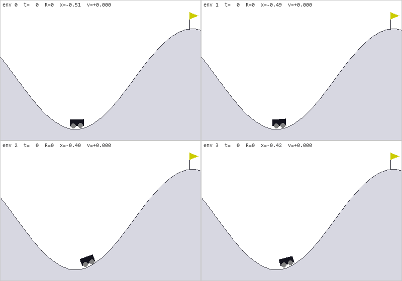

# Reinforcement learning in NVIDIA Warp + warp-nn

Gymnasium-style environments written entirely in [NVIDIA Warp](https://github.com/NVIDIA/warp)
kernels, plus a PPO training loop built on [warp-nn](https://pypi.org/project/warp-nn/)
(`Linear`, `Tanh`, `Adam`) and `wp.Tape` autodiff. No PyTorch, no JAX, no Box2D --
the physics, the policy, the advantage estimation and the loss all live on the
device, and a whole rollout (or update epoch) replays as a single CUDA graph.

Three environments so far: **CartPole**, **Lunar Lander** and **Mountain Car**.

```
python train.py --env cartpole     --save weights/cartpole.npz      # seconds  -> return 500
python train.py --env lunarlander  --save weights/lunarlander.npz   # ~1 min   -> return ~275
python train.py --env mountaincar  --save weights/mountaincar.npz   # ~8 s     -> return ~-102
python play.py  --env lunarlander  --weights weights/lunarlander.npz   # watch it fly
python -m pytest tests -q                                           # 22 checks
```


## Results

| environment | greedy evaluation (128 episodes) | budget | wall clock | solved threshold |
| --- | --- | --- | --- | --- |
| cartpole | **500.0 +/- 0.0** (min 500) | 500k steps | ~3-8 s | 475 |
| lunarlander | **274.5 +/- 18.6** (min 234, max 312, mean length 218) | 16M steps | ~60 s | 200 |
| mountaincar | **-102.0 +/- 8.8** (min -110, max -83) | 4M decisions | ~8 s | -110 |

End-to-end throughput on an RTX 5060 is 85k-170k env steps/s for cartpole and
250k-290k steps/s for the lander, *including* the PPO update; the rollout alone runs
at several million steps/s. For reference, Gymnasium's own
`demo_heuristic_lander` controller scores 249.8 in this environment (see below).

## Layout

The split the code is organized around: everything environment-agnostic in
`warp_rl/`, everything environment-specific in one module per environment under
`warp_rl/envs/`.

| file | contents |
| --- | --- |
| `warp_rl/vec_env.py` | `WarpVecEnv`: device buffers, RNG, episode bookkeeping, truncation, auto-reset, spaces, on-device stats |
| `warp_rl/kernels.py` | shared kernels: sampling, rollout stores, GAE, advantage normalization, gathers, PPO loss/metrics |
| `warp_rl/ppo.py` | `PPO` / `PPOConfig`: rollout, GAE, minibatch updates, CUDA-graph capture, evaluation |
| `warp_rl/models.py` | warp-nn MLPs with orthogonal init, `ActorCritic`, save/load |
| `warp_rl/render.py` | `TiledRenderer`: window or off-screen surface, N-environment grid, HUD, events |
| `warp_rl/registry.py` | env id -> (env class, renderer class, recommended PPO settings) |
| `warp_rl/envs/cartpole.py` | CartPole: params, kernels, `CartPoleVectorEnv`, `CartPoleRenderer` |
| `warp_rl/envs/lunar_lander.py` | Lunar Lander: params, kernels, `LunarLanderVectorEnv`, `LunarLanderRenderer` |
| `warp_rl/envs/mountain_car.py` | Mountain Car: params, kernels, `MountainCarVectorEnv`, `MountainCarRenderer` |
| `train.py` / `play.py` | CLI entry points, both take `--env` |
| `tests/` | Gymnasium parity (cartpole, mountain car), spec + physics checks (lander), PPO kernel checks |

## The environment interface

```python
import warp_rl

env = warp_rl.make("lunarlander", num_envs=1024, device="cuda:0")
obs, info = env.reset(seed=0)                                  # obs: wp.array (N, obs_dim)
obs, reward, terminated, truncated, info = env.step(actions)   # actions: int32 (N,)
```

* Everything returned is a device-resident `wp.array` (`float32`; the flags are
  0.0/1.0 so they feed the GAE kernel directly). The arrays are reused every
  step -- copy what you want to keep.
* Spaces are real `gymnasium.spaces` objects when Gymnasium is installed.
* **Auto-reset is same-step** (the SB3/EnvPool convention, not Gymnasium 1.0's
  next-step reset): a finished env is reset inside the same `step`, and
  `info["final_observation"]` carries the true next state so truncated episodes
  can still be bootstrapped.
* `env.pop_episode_stats()` returns `(mean_return, mean_length, count)` for the
  episodes finished since the previous call -- accumulated on the device, so one
  3-float readback per iteration is the only host sync in the training loop.

### Adding an environment

Subclass `WarpVecEnv`, declare `obs_dim` / `num_actions`, and write two hooks:

```python
class MyEnv(WarpVecEnv):
    obs_dim, num_actions = 5, 3

    def _reset(self):   # re-initialize every env whose needs_reset flag is set,
        ...             # and write its first observation into self.obs

    def _step(self, actions):   # advance the physics; write self.final_obs,
        ...                     # self.rewards and self.terminated
```

The base class owns the rest: return/length accumulation, the time limit,
auto-reset masking, episode statistics and the Gymnasium-facing API. Add a
`TiledRenderer` subclass with `fetch()` + `draw_tile()` for visuals, then one
`EnvSpec` entry in `warp_rl/registry.py` with the recommended PPO settings, and
`--env myenv` works everywhere.

## CartPole

A line-by-line port of Gymnasium's `CartPoleEnv` (`euler` integrator), so
trajectories agree to float32 rounding (`max |warp - gymnasium| = 2.4e-07` over
200 steps) and episodes terminate on exactly the same step --
`tests/test_cartpole_env.py` checks both, and
`train.py --env cartpole --gym-eval 10` plays the trained policy in the real
Gymnasium environment (500.0).

## Lunar Lander

Everything the *agent* sees is ported from `gymnasium/envs/box2d/lunar_lander.py`
(LunarLander-v3, discrete): the 11-chunk random terrain with its flat helipad
(including Gymnasium's `0.33`-weighted smoothing quirk, which puts the pad at
`0.99 * H/4`), the 8-dim observation, the shaping reward with its 0.3/0.03 fuel
costs, the +/-100 terminal rewards, the engine impulses with their random
dispersion, and the four discrete actions.

The *dynamics* are not Box2D -- there is no constraint solver here. The lander
is a single rigid body (hull + welded legs) whose mass, centre of mass and
moment of inertia are computed from the very same polygons and densities Box2D
is given (4.96 kg, 0.92 kg m^2), integrated semi-implicitly with 8 substeps, and
it touches the ground through two leg contact points resolved with a penalty
spring-damper plus Coulomb friction. Deviations, all documented at the top of
`warp_rl/envs/lunar_lander.py`:

* rigid legs instead of sprung revolute joints, and compliant contacts
  (millimetres of penetration under weight) instead of hard constraints;
* friction 0.5 rather than Box2D's slippery 0.1;
* touching down faster than `CRASH_SPEED = 4 m/s` counts as a crash -- our
  springy legs would otherwise absorb an unsurvivable slam that Box2D would
  turn into a hull impact;
* "came to rest" (velocities below threshold for half a second with no engine
  firing) replaces Box2D's sleep test for the +100 landing bonus;
* `reset()` skips Gymnasium's extra zero-action step; no wind, no continuous
  actions.

**How it is validated.** Parity with Box2D trajectories is impossible by
construction, so `tests/test_lunar_lander.py` pins down the specification
instead -- the observation vector against the Gymnasium formula (exact), the
reward against the shaping-delta formula over thousands of transitions, the
terrain layout, free-fall gravity, main-engine delta-v, and the crash /
out-of-bounds rules -- and then validates the dynamics end-to-end by flying
**Gymnasium's own `demo_heuristic_lander` controller**, unmodified: it scores
249.8 and lands 119/128 times here.

`tools/crosscheck_box2d.py` takes that further and runs the same controller in
both worlds, plus a Warp-trained policy in Box2D (needs `gymnasium[box2d]`):

```
                                        mean     std  landed
gymnasium heuristic in warp            242.3   138.3  29/32
gymnasium heuristic in box2d           243.8    99.2  29/32
warp-trained policy in box2d            44.5    16.1   0/32
```

The reference controller scores the same in both environments, which is the
result that matters: as a control problem this is LunarLander. A *learned*
policy is another story -- it transfers poorly (44.5 in Box2D against 274 at
home, no clean landings), and the sharper it gets here the worse it transfers,
because it lands the way our compliant legs reward and Box2D's articulated ones
behave differently on touchdown. Train against the physics you intend to fly.

## Mountain Car

Another line-by-line port of a classic-control environment, so parity with
`MountainCar-v0` is exact again (`max |warp - gymnasium| = 6e-08` over 200
steps, and the same 200-step truncation).

What makes it interesting is that the reward is `-1` per step until the flag,
and **nothing else** -- so an untrained policy gets no gradient signal at all
unless it stumbles onto the goal, and a uniformly random policy never does:
**0 of 4096 episodes** reach the flag, at any horizon we tried. The env
therefore takes one addition, `action_repeat`: the agent decides every *k*
physics steps and the action is held in between. Random *held* actions resonate
up the hill, which is the whole difference:

| action_repeat | random episodes reaching the flag |
| --- | --- |
| 1 (= MountainCar-v0) | 0 / 4096 |
| 4 | 0 / 4096 |
| 8 (trained on) | 55 / 4096 |
| 16 | 354 / 4096 |

Rewards still count physics steps, and `max_episode_steps` counts decisions, so
the registry's `25 decisions x repeat 8` is exactly MountainCar-v0's 200-step
limit and the returns are directly comparable. `action_repeat=1` (the default)
is the untouched environment; `tests/test_mountain_car.py` checks that one
repeat-8 step equals eight single steps in state, reward and termination.

PPO solves it in ~8 s (greedy return -102.0, threshold -110), and the same
policy scores **-100.0 in the real Gymnasium `MountainCar-v0`**
(`train.py --env mountaincar --gym-eval 20`) -- unsurprising, since the physics
is the same code.



## Watching it play

`play.py` drives any registered environment (ESC or closing the window quits):

```
python play.py --env lunarlander --weights weights/lunarlander.npz
python play.py --env mountaincar --weights weights/mountaincar.npz
python play.py --env lunarlander --num-render 9 --tile 400 280      # nine landers at once
python play.py --env cartpole --gif media/cartpole.gif              # record instead of display
python play.py --env lunarlander --random --stochastic              # an untrained policy
```

With no `--weights` it trains first and then plays. Recording works headless
(`SDL_VIDEODRIVER=dummy`), and `--gif out.mp4` writes video instead of a GIF.


## The training loop

Standard PPO (CleanRL-shaped), with every per-sample operation as a Warp kernel:

1. **Rollout** -- policy forward, categorical sampling (inverse-CDF from a
   log-softmax with a per-env RNG state), env step, stores into `(T*N, ...)`
   buffers. Captured as one CUDA graph.
2. **Values and GAE** -- one batched value pass over the observation buffer and
   one over the pre-auto-reset next observations, then `gae_kernel` (one thread
   per env, walking time backwards). Bootstrapping uses
   `V(s') * (1 - terminated)`, so truncated episodes bootstrap and terminated
   ones do not. Advantages are normalized over the batch with a two-moment
   reduction kernel.
3. **Update** -- `update_epochs` passes over a shuffled batch. Per minibatch:
   gather kernels build the minibatch, the tape records the policy and value
   forwards plus `ppo_loss` (clipped surrogate + 0.5*value MSE - entropy bonus,
   summed with `wp.atomic_add`), `tape.backward()` fills the gradients, warp-nn's
   `Adam` (global-norm clipping) steps, gradients are cleared. A whole epoch is
   captured as one CUDA graph.

Two implementation notes worth knowing if you build on this:

* **warp-nn caches one output array per (shape, dtype)**, so two calls of the
  same module with the same input shape share a buffer. `compute_advantages`
  copies the first value pass out before running the second.
* **`array.zero_()` costs a fixed ~130 us per call** on this driver, which at 23
  gradient arrays x 80 minibatches per iteration was 90% of the training time.
  The trainer zeroes gradients with a one-line Warp kernel instead
  (`kernels.zero_kernel`), ~30x faster, which cut the cartpole iteration from
  256 ms to 96 ms. That is also why `Adam` is constructed with
  `disable_graph=True`: the trainer captures whole epochs itself, and CUDA graph
  captures cannot nest.

## Hyperparameters

Each environment's recommended settings live in its `EnvSpec` in
`warp_rl/registry.py`; every one has a CLI flag that overrides it.

| | cartpole | lunarlander | mountaincar |
| --- | --- | --- | --- |
| num_envs x num_steps | 256 x 32 = 8192 | 512 x 64 = 32768 | 512 x 32 = 16384 |
| total_timesteps | 500,000 | 16,000,000 | 4,000,000 |
| learning_rate (annealed) | 1e-3 | 1e-3 | 1e-3 |
| gamma / gae_lambda | 0.99 / 0.95 | 0.999 / 0.98 | 0.99 / 0.95 |
| minibatches x epochs | 8 x 10 | 8 x 4 | 8 x 4 |
| ent_coef | 0.005 | 0.01 | 0.02 |
| hidden | (64, 64) tanh | (128, 128) tanh | (64, 64) tanh |
| max_episode_steps | 500 | 1000 | 25 (x8 repeat = 200) |

Shared defaults: `clip_coef 0.2`, `vf_coef 0.5`, `max_grad_norm 0.5`, normalized
advantages. The lander really wants `gamma = 0.999` -- at 0.99 it never learns
to land. For mountain car, `total_timesteps` counts agent decisions, so 4M
decisions is 32M physics steps.

## Using it as a library

```python
import warp_rl

cfg = warp_rl.default_config("lunarlander", seed=0)      # recommended settings
trainer = warp_rl.PPO(cfg)
trainer.train(callback=lambda s: print(s["global_step"], s["episodic_return"]))
print(trainer.evaluate(num_envs=128))
trainer.agent.save("weights/lunarlander.npz")
```

`--device cpu` works too (same kernels, far slower); `--no-graph` disables graph
capture, which is useful when debugging a kernel.

## Requirements

`warp-lang`, `warp-nn`, `numpy`. Optional: `gymnasium` (space objects, the
cartpole parity tests, `--gym-eval`), `pygame` (rendering) and `imageio`
(recording).
